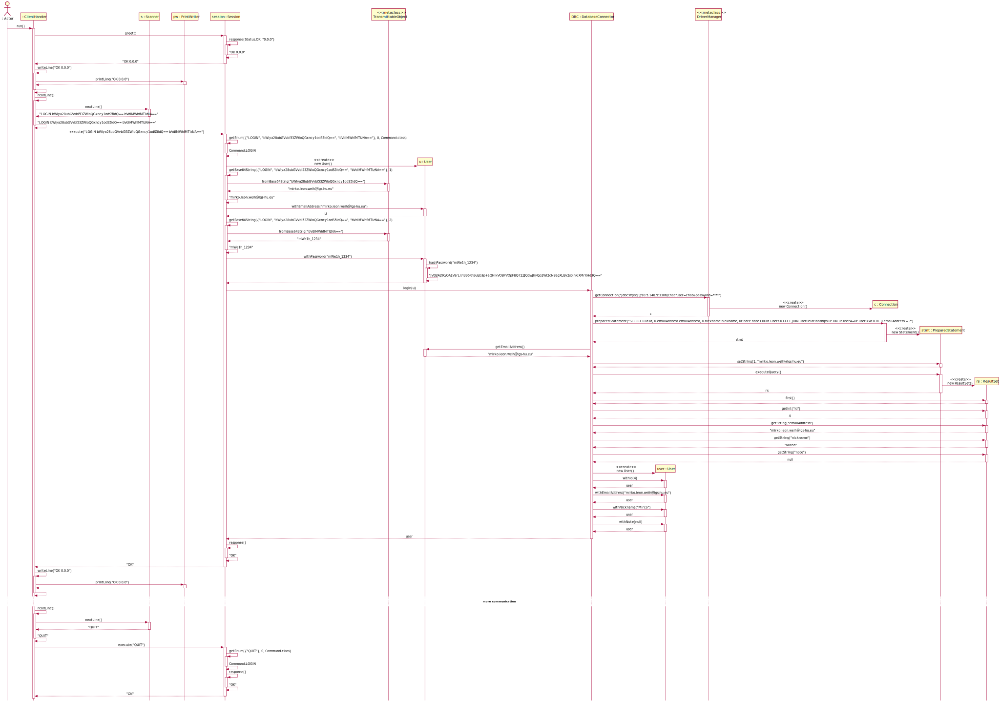

# Server for our Chatservice

## Klassendiagramm


## Sequenzdiagramm

* verbindung ist bereits aufgebaut
* client sendet Anfrage für Login mit E-Mail-Addresse `mirko.leon.weih@lgs-hu.eu` und Passwort `mWe1h_1234` 



## Protokoll

### Designentscheidungen

#### 1. Request-Response

* Client sendet Anfrage -> Server antwortet
* Client kann nicht aktiv vom Server benachrichtigt werden
* Implementierung vergleichsweise einfach
* Client kann Nachrichten nur auf Anfrage empfangen

Beispiel:

```text
> SENDMESSAGE [channelID] [data] [dataType]
< +OK
> GETMESSAGES [channelID] [beginTime] [endTime]
< +OK 3
< [data] [dataType] [timestamp]
< [data] [dataType] [timestamp]
< [data] [dataType] [timestamp]
> GETMESSAGES
< +OK 1
< [channelID] [data] [dataType] [timestamp]
> GETMESSAGES
< +OK 2
< [channelID] [data] [dataType] [timestamp]
< [channelID] [data] [dataType] [timestamp]
```

#### 2. Request-Response erweitert durch Events

* grundsätzlich gleiches Prinzip
* Server kann zusätzlich unabhängig vom Client Nachrichten mit bestimmtem Prefix senden, der die Nachricht als Event kennzeichnet
* Events können vom Client ignoriert werden
* Funktionen wie "typing indicator" lassen sich so implementieren
* Nachrichten können sowohl auf Anfrage vom Server geholt werden als auch aktiv vom Server übermittelt werden

Beispiel:

```text
> SENDMESSAGE [channelID] [data] [dataType]
< +OK
< EVENT:MESSAGE [channelID] [data] [dataType] [timestamp]
< EVENT:ISTYPING [channelID] [userID]
< EVENT:MESSAGE [channelID] [data] [dataType] [timestamp]
> GETMESSAGES [channelID] [beginTime] [endTime]
< +OK 3
< [data] [dataType] [timestamp]
< [data] [dataType] [timestamp]
< [data] [dataType] [timestamp]
```

#### 3. Zwei parallele Socketverbindungen

* erste Verbidung arbeitet nach Request-Response-Prinzip
* zweite Verbindung ist unidirektional und streamt neu eintreffende Nachrichten an Client
* ggf. kein Vorteil gegenüber [2.](#2.-request-response-erweitert-durch-events)

Beispiel:

```text
Connection 1:
> SENDMESSAGE [channelID] [data] [dataType]
< +OK
> GETMESSAGES [channelID] [beginTime] [endTime]
< +OK 3
< [data] [dataType] [timestamp]
< [data] [dataType] [timestamp]
< [data] [dataType] [timestamp]

Connection 2:
> ISTYPING [channelID] [userID]
> MESSAGE [channelID] [data] [dataType] [timestamp]
> ISTYPING [channelID] [userID]
```

## Datenbankanbindung

* authentifizierung wird nach login vorerst nicht erneut durchgeführt -> änderung des passworts führt nicht zu ende der Sitzung